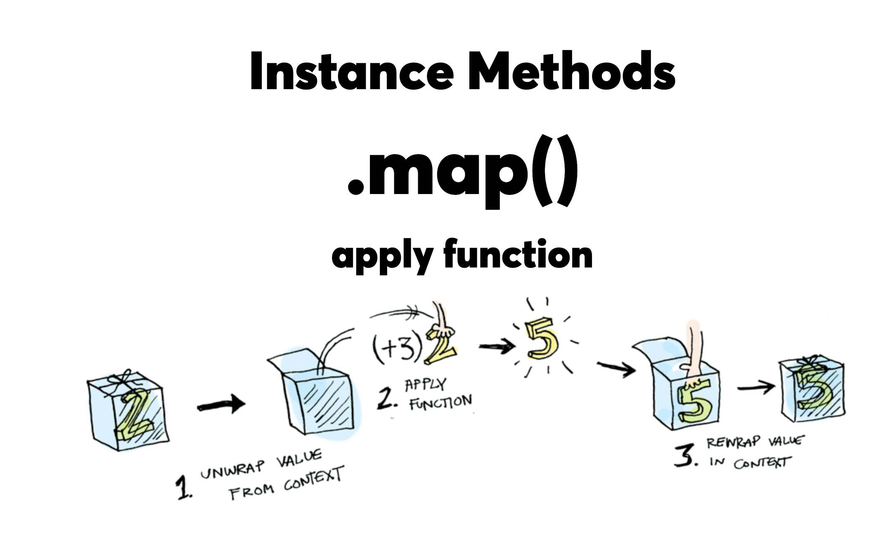

# Mdx-deck presentation about the Maybe Monad




## Development

To run the presentation deck in development mode:

```sh
npm start
```

Edit the [`deck.mdx`](deck.mdx) file to get started.

## Exporting

To build the presentation deck as static HTML:

```sh
npm run build
```

To export a PDF:

```sh
npm run pdf
```

To export an image of the title slide:

```sh
npm run image
```

For more documentation see the [mdx-deck][] repo.

[mdx-deck]: https://github.com/jxnblk/mdx-deck
