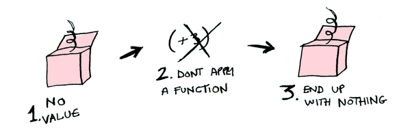

import { Head, Image, Appear } from 'mdx-deck';
import LayoutDark from './LayoutDark';
import LayoutLight from './LayoutLight';
import { CodeSurfer } from 'mdx-deck-code-surfer';

export { default as theme } from './theme';

<Head>
  
  <title>Maybe Type</title>
</Head>

export default LayoutLight;

## Let's try some Maybe monads in JS

---

<Appear>
  <h2>wtf is monad?</h2>
  <h2>🤷‍♂</h2>
</Appear>

export default LayoutLight;

---

> "A monad is just a monoid in the category of endofunctors"

export default LayoutLight;

---

<CodeSurfer
  code={require('raw-loader!./src/step1/utils.jsx')}
  dark={true}
  lang="javascript"
  title="Practice"
  steps={[
    { notes: 'utils.js' },
    { lines: [1] },
    { lines: [3] },
    { range: [5, 8] }
  ]}
/>

export default LayoutDark;

---

<CodeSurfer
  code={require('raw-loader!./src/step1/index.jsx')}
  dark={true}
  lang="javascript"
  title="Increment"
  steps={[
    { lines: [1] },
    { lines: [3] },
    { lines: [4] },
    { notes: 'Live example' }
  ]}
/>

export default LayoutDark;

---

<CodeSurfer
  code={require('raw-loader!./src/step2/utils.jsx')}
  dark={true}
  lang="javascript"
  title="Solution"
/>

export default LayoutDark;

---

<Image src="./assets/images/ifHell.png" />

---

import { SplitRight } from 'mdx-deck/layouts';

export default SplitRight;

## Solution?

# Maybe Monad

### Maybe = Just a | Nothing

export default LayoutLight;

---

## Instance Methods

# .map()

### apply function

export default LayoutLight;

---

## Instance Methods

# .map()

### map over nothing

export default LayoutLight;

---

<CodeSurfer
  code={require('raw-loader!./src/step2/index.jsx')}
  dark={true}
  lang="javascript"
  title="Maybe Monad"
  steps={[
    { lines: [2] },
    { lines: [4] },
    { range: [6, 7] },
    { lines: [9] },
    { lines: [10] },
    { notes: 'Live example' }
  ]}
/>

export default LayoutDark;

---

## But what can I do with Just 3 or Nothing

## 🤔

export default LayoutLight;

---

## Instance Methods

# .option()

### unpack value and provide default

export default LayoutLight;

---

<CodeSurfer
  code={require('raw-loader!./src/step3/index.jsx')}
  dark={true}
  lang="javascript"
  title="Option"
  steps={[
    { lines: [1] },
    { range: [6, 7] },
    { range: [3, 4] },
    { range: [8, 9] },
    { range: [11, 12] },
    { range: [14, 15] },
    { notes: 'Live example' }
  ]}
/>

export default LayoutDark;

---

## Helper Functions

# .prop()/propPath()

### safly get object(nested object) property(array index)

export default LayoutLight;

---

<CodeSurfer
  code={require('raw-loader!./src/step4/index.jsx')}
  dark={true}
  lang="javascript"
  title="PropPath"
  steps={[
    { lines: [1] },
    { range: [3, 12] },
    { lines: [14] },
    { lines: [15] },
    { notes: 'Live example' }
  ]}
/>

export default LayoutDark;

---

## Instance Methods

# .chain()

### unpack the value inside the Maybe

export default LayoutLight;

---

<CodeSurfer
  code={require('raw-loader!./src/step5/index.jsx')}
  dark={true}
  lang="javascript"
  title="Chain"
  steps={[
    { range: [1, 2] },
    { lines: [4] },
    { range: [5, 19] },
    { lines: [20] },
    { lines: [23] },
    { lines: [25] },
    { lines: [26] },
    { lines: [27] },
    { notes: 'Live example' }
  ]}
/>

export default LayoutDark;

---

## Instance Methods

# .of()

### wrap any value into Maybe as a Just

export default LayoutLight;

---

## Instance Methods

# .alt()

### providing a means for a fallback or alternative value

export default LayoutLight;

---

<CodeSurfer
  code={require('raw-loader!./src/step6/utils.jsx')}
  dark={true}
  lang="javascript"
  title="Final Example"
  steps={[
    { notes: 'Netgutu blogpost url creator' },
    { lines: [1] },
    { range: [3, 12] },
    { lines: [14] },
    { range: [15, 19] },
    { lines: [20] },
    { range: [21, 24] },
    { range: [26, 29] },
    { range: [31, 34] }
  ]}
/>

export default LayoutDark;

---

<CodeSurfer
  code={require('raw-loader!./src/step6/index.jsx')}
  dark={true}
  lang="javascript"
  title="Final Example"
  steps={[
    { lines: [1] },
    { range: [3, 6] },
    { range: [8, 10] },
    { notes: 'Live example' }
  ]}
/>

export default LayoutDark;

---

# Q&A

export default LayoutLight;

---

# SOURCES

- https://egghead.io/courses/safer-javascript-with-the-maybe-type
- http://adit.io/posts/2013-04-17-functors,_applicatives,_and_monads_in_pictures.html

export default LayoutLight;

---

# THANK YOU

export default LayoutLight;
